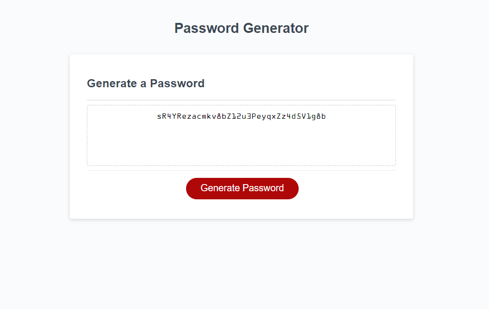
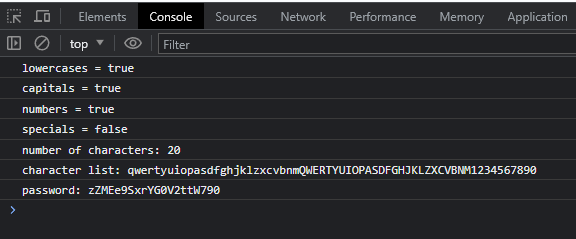

# Instant Password Button

## Description

This is a single-page JavaScript application which, upon answering brief criteria questions, provides the user with a randomized, secure password. The provided password can include any or all of lowercase, capital, numerical, or special characters according to the user's preferences, and can render a password between 8 and 128 characters long.

## Installation

The deployed application is available at https://kmcintosh821.github.io/instant-password-button/

## Usage

Upon clicking the red "Generate Password" button on the page, the user is given four prompts for character types -- in order, it asks whether to include lowercase letters, capital letters, numbers, and special symbols. Answering "OK" corresponds to "yes", and answering "Cancel" corresponds to "no". If the user answers "Cancel" to all four of these prompts, the function ends without offering a password. 

However, if any of the four prompts are answered with "OK", it continues to prompt the user for a desired password length, specifying between 8 and 128 characters long. If the user provides a number lower or higher than this range, it will inform the user that the number is invalid, and repeat the prompt. If the user inputs a non-numerical value or clicks "Cancel", the function ends without offering a password, as with the previous step.

If all prompts are answered adequately, the text box in the center of the page (with "Your Secure Password" as a placeholder) has its text replaced with the user's randomly generated password within the criteria provided. Passwords can be generated as many times as the user desires without refreshing the page, and each time, the previous random password will be replaced with the new one.

If the user has the console open while using the application, their choices will be logged as they proceed through the prompts.

## Screenshots

The following image demonstrates the web application's appearance, with an example password generated:

The following image shows what is logged in the console as the user makes their choices in the prompts:

## Credits

Assets provided by the Rutgers Fullstack Bootcamp curriculum.

## License

Please refer to the license in the repo.